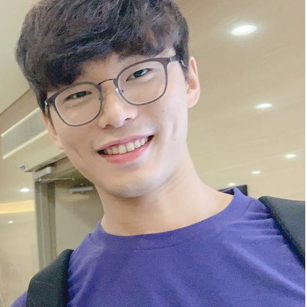

# Hyunsu Kim

Masters student, Static learner

<a href="mailto:hyunsu.kim00@kaist.ac.kr">hyunsu.kim00@kaist.ac.kr</a>
| <a href="https://prosys.kaist.ac.kr" target="_blank">Programming Systems Laboratory</a>

## Currently

I am a member of <a href="https://prosys.kaist.ac.kr" target="_blank">Programming Systems Laboratory (Prosyslab)</a> in KAIST advised by <a href="https://kihongheo.kaist.ac.kr" target="_blank">Kihong Heo</a>.

## Research Interests

Continuous vulnerability reasoning in software

Abstract interpretations in security domain

Program representation for robust learning

Scalable model for program synthesis and reasoning

## Education

`2020 - now`
**Masters student, KAIST**

- Graduate School of Information Security

`2014 - 2020`
**B.S., KAIST**

- School of Computing, Mathematical Science (Double major)

`2012 - 2013`
**Gangwon Sci. High School**

## Publications

`ICSE 2022`
**Learning Probabilistic Models for Static Analysis Alarms**

- Hyunsu Kim, Mukund Raghothaman, and Kihong Heo
- 🏆 **Best Artifact Award**
- Proceedings of the 44th ACM/IEEE International Conference on Software Engineering,
  ICSE 2022,
  May 2022.
- [[paper](publications/icse2022.pdf)] [[full-version](publications/icse2022-full.pdf)] [[video](https://youtu.be/FzshZZyqU14)] [[artifact](https://zenodo.org/record/6300874#.YmOChpPP07Y)]

`KCC 2021`
**베이지안 알람 랭킹 시스템의 거짓 일반화 문제와 해결 방안**

- Hyunsu Kim and Kihong Heo
- 🏆 **우수논문상**
- Korea Computer Congress, KCC 2021, June 2021.

`DEEM 2019`
**Data Cleaning for Accurate, Fair, and Robust Models: A Big Data - AI Integration Approach**

- Kihyun Tae, Yuji Roh, Young Hun Oh, Hyunsu Kim, and Steven Euijong Whang
- Proceedings of the 3rd International Workshop on Data Management for End-to-End Machine Learning,
  DEEM at ACM SIGMOD 2019,
  June 2019.

## Talks

`2022`
[_When Usability met 2FA_](https://pretalx.com/bsidesmunich2022/talk/review/FNUBDWKZVAB7YTLECBVYP3VULC8RVJKA), [BSides Munich 2022](https://2022.bsidesmunich.org/agenda/), May 2022 (to appear).

- Hyunsu Kim, Junoh Lee, Myeong Geun Shin, Kihong Heo and Sang Kil Cha.

[_BayeSmith: 정적 분석 알람을 위한 확률 모델 학습_](slides/sigpl-winter-school-2022.pdf), [SIGPL Winter School 2022](https://sigpl.or.kr/school/2022w/), Feb 2022.

## Awards

`2022`
_Best Artifact Awards_, ICSE 2022.

`2021`
_우수논문상_, KCC 2021, Korean Institute of Information Scientists and Engineers (한국정보과학회).

`2018`
_Qualcomm Innovation Awards_, Qualcomm-KAIST Innovation Awards Committee.

## Occupation

`2019`
**Classum**

- Web front-end developer

## Projects

Check out my github repo: 

### .

Last updated: Apr 2022
